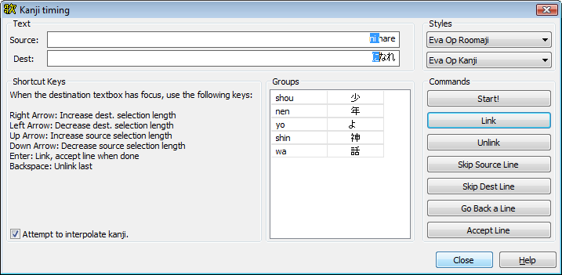

The kanji timer makes it easy to copy timed karaoke from one set of already karaoke timed lines to another set of yet untimed lines. Primarily intended for adding karaoke to Japanese songs.

Here is a video demonstration of the kanji timer in action: [Download demonstration video](http://www.animereactor.dk/aegisub/demovids/kanji-timer.avi) (XviD MP3 AVI, 5 min 20 sec, 12 MB)

## Before you start ##

The kanji timer attempts to pair syllables in one (timed) input line with a given style with syllables in a corresponding (untimed) line with another style. In other words, the timed input lines should all have same style ("romaji" for example) and the untimed ones another ("kanji" for example). Having more timed source lines than untimed destination ones or vice versa can confuse the tool, but it's usually possible to un-confuse it, see below. In order to correctly pair source lines with destination ones, both sets must be in the same order in the grid. For example, this works:

    Timed line 1
    Untimed line 1
    Timed line 2
    Untimed line 2

And so does this:

    Timed line 1
    Timed line 2
    Untimed line 1
    Untimed line 2

But this does **not** (pairs lines wrong):

    Timed line 1
    Timed line 2
    Untimed line 2
    Untimed line 1

## Using the kanji timer ##

The kanji timer dialog looks like this:

{: class="center"}

The first thing you need to do is to select which styles are used for the timed input lines and the untimed output lines respectively. This is done in the upper right corner of the dialog; the top dropdown is the source style and the bottom one is the destination. When you've done this, click the start button.

Now, you'll see the first syllable of the first source line highlighted in the source text field, and a suggestion for the destination syllable highlighted in the destination field. What you do now is "group" each source syllable with one or more kanji (or other syllables) in the destination. This is done using the following keyboard shortcuts:

Enter
: Accept the highlighted grouping (and go to next line if all syllables are grouped).

Right arrow
: Increase the destination highlight length.

Left arrow
: Decrease the destination highlight length.

Up arrow
: Increase the source highlight length.

Down arrow
: Decrease the source highlight length.

Backspace
: Un-groups (or unlinks) the last accepted syllable and lets you try to group it again (useful if you make a mistake).
{: .dl-horizontal}

## Things to note ##

* Don't use the mouse to change the highlights; it confuses the tool a lot. Use the keyboard shortcuts instead, they're much faster.
* The destination line can already be k-timed, but if it is, the kanji timer will overwrite those timings.
* Empty syllables will be copied alone, or will be combined with the surrounding syllables if those are to be combined.
* Any ASS override tags appearing before each \k will be copied directly without modification, but tags after each \k is currently not copied at all.
* If you have more source than destination lines or vice versa, you can use the "Skip source line" or "Skip destination line" to make sure the pairing of source/destination lines is correctly done.

