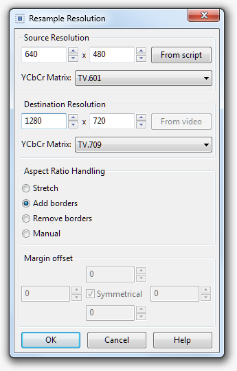

The Resolution Resampler is a built-in tool designed to change the [[resolution
of the script|Script_Resolution]] while transforming all affected tags so it
ends up looking the same. It can also offset all margins (and absolute
positions) by a specific value. Uses include merging two scripts with different
resolutions, converting a script for a 4:3 video to its 16:9 equivalent, and
converting between 1:1 and anamorphic pixel formats.

## Overview
{: class="center"}

There are three main parts to the resolution resampler: the source
resolution, destination resolution, and what to do if the source and
destination have different aspect ratios.

By default, the source resolution is set to the current script properties and the destination resolution is set to the video's properties, which is normally what you want.
Changing the source settings is typically only useful to repair previous incorrect resampling or scripts typeset incorrectly.

If you're resampling from SD to HD resolutions, you probably want to convert the YCbCr matrix from TV.601 to TV.709, and vice-versa when converting from HD to SD.

If the new resolution and old resolution don't have the same aspect ratio, you have four options:

1. Stretch the subtitles to the new AR.
   This is intended for when one or both of the resolutions is anamorphic, and actually represent the same picture.
1. Automatically add the required margins to center the old video within the new video.
   Use this if your new video has black borders or shows more of the picture than the old one.
1. Automatically remove the required margins to center the old video within the new video.
   Use this if the source video has black borders and your new video does not.
1. Manually set the margins to offset all lines by.
   Note that margins are added *before* rescaling, not after.

## Examples

### 4:3 SD to 16:9 HD
For example, if you have subtitles typeset to a 640x480 video, and want to
apply the same subtitles to a 1280x720 video (which is widescreen, therefore
either showing more video on the left and right margins or with black
borders), you'd set the resampler to the settings shown in the
screenshot above.

### Anamorphic 720x480 to 640x480
For this, you'd set source resolution to 720x480, destination resolution
to 640x480, and select the "Stretch" aspect ratio handling
